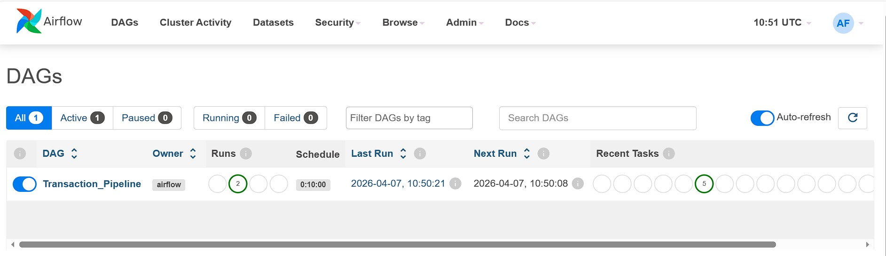
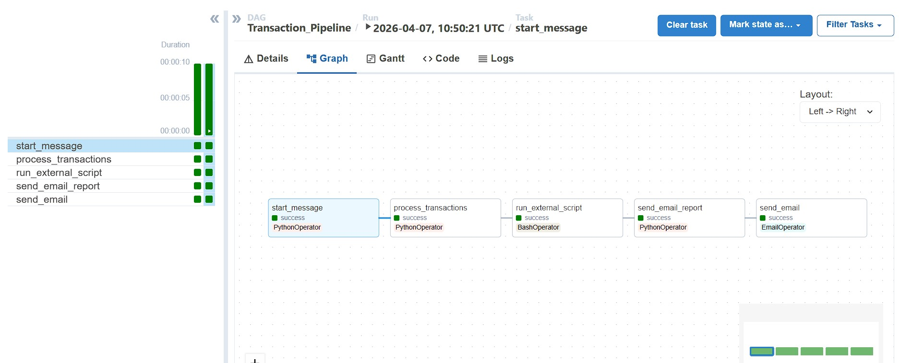
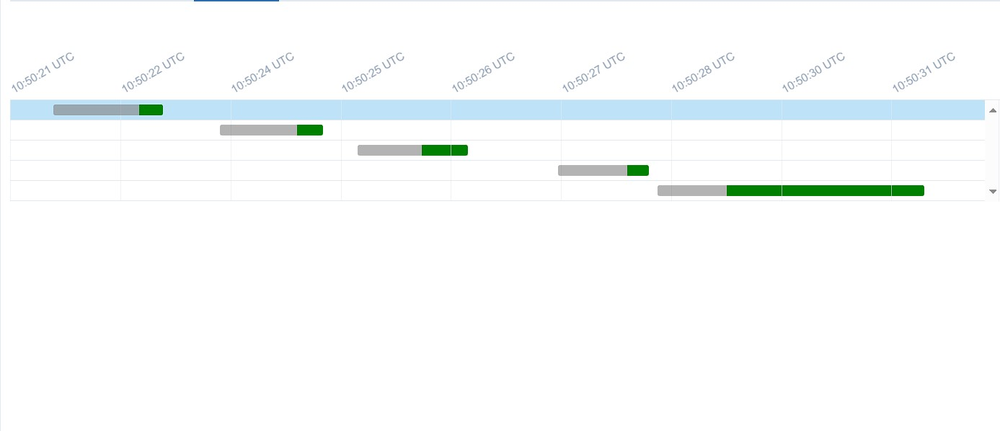
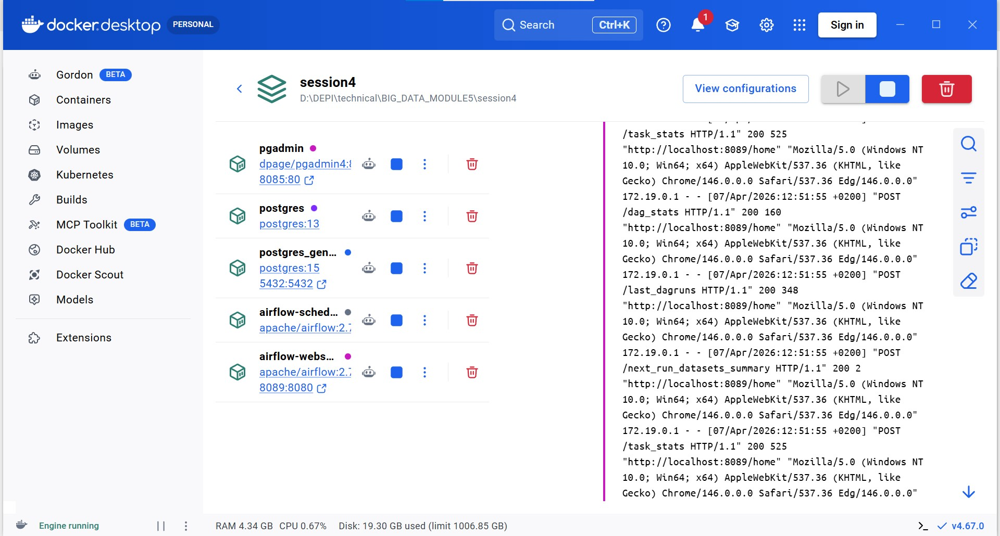
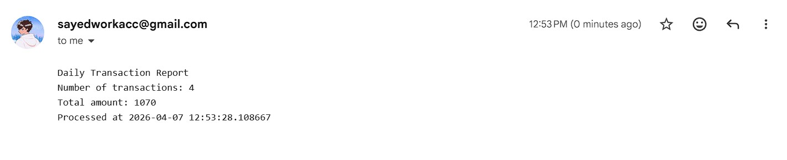

# ✈️ Airflow Transaction Pipeline

## 📋 Description
An automated data pipeline built with **Apache Airflow** that simulates a 
transaction processing system. The DAG runs every 10 minutes, processes 
transactions, generates a report, and sends it via email automatically.

---

## 🏗️ Pipeline Architecture

```
start_message → process_transactions → run_external_script → send_email_report → send_email
```

| Task | Operator | Description |
|------|----------|-------------|
| `start_message` | PythonOperator | Prints pipeline start timestamp |
| `process_transactions` | PythonOperator | Calculates totals & saves report to file |
| `run_external_script` | BashOperator | Runs external script to append timestamp |
| `send_email_report` | PythonOperator | Reads report file & stores in XCom |
| `send_email` | EmailOperator | Sends the report via Gmail SMTP |

---

## 🛠️ Tech Stack
- **Apache Airflow** 2.7.1
- **Python** 3.9
- **PostgreSQL** 13 (Airflow metadata)
- **PostgreSQL** 15 (General database)
- **pgAdmin** 4
- **Docker & Docker Compose**
- **Gmail SMTP** (email delivery)

---

## 🚀 Setup & Installation

### Prerequisites
- Docker Desktop installed
- Gmail account with App Password enabled
- Mobile data or network with SMTP port 587 open

### Steps

**1. Clone the repository**
```bash
git clone https://github.com/your-username/airflow-transaction-pipeline.git
cd airflow-transaction-pipeline
```

**2. Configure environment variables in `airflow.yaml`**
```yaml
- AIRFLOW__SMTP__SMTP_USER=your_email@gmail.com
- AIRFLOW__SMTP__SMTP_PASSWORD=your_app_password
- AIRFLOW__SMTP__SMTP_MAIL_FROM=your_email@gmail.com
```

**3. Start the containers**
```bash
airflow.yaml up -d
```

**4. Access Airflow UI**
```
URL:      http://localhost:8089
Username: admin
Password: admin
```

**5. Enable the DAG**
- Find `Transaction_Pipeline` in the DAGs list
- Toggle it ON
- It will run automatically every 10 minutes

---

## 📁 Project Structure
```
airflow-transaction-pipeline/
├── dags/
│   └── Transaction_Pipeline.py   # Main DAG definition
├── data/
│   ├── process_transactions.py   # External script (BashOperator)
│   └── transactions_report.txt  # Generated report output
├── screenshots/
│   ├── airflow_ui.jpg
│   ├── docker_ui.jpg
│   ├── email.jpg
│   ├── Grantt.jpg
│   └── Graph.jpg
├── airflow.yaml           # Docker services configuration
└── README.md
```

---

## 📊 Screenshots

### Airflow DAGs Dashboard


### DAG Graph View — All tasks successful ✅


### Gantt Chart — Task execution timeline


### Docker Desktop — Running containers


### Email Report — Received in inbox 📧


---

## 📧 Email Report Sample
```
Daily Transaction Report
Number of transactions: 4
Total amount: 1070
Processed at 2026-04-07 12:53:28.108667
```

---

## ⚠️ Notes
- Make sure port **587** is accessible on your network (SMTP).
  ISP-level blocking is common — mobile data is a reliable workaround.
- Gmail requires an **App Password** (not your regular password).
  Generate one at: myaccount.google.com/apppasswords
